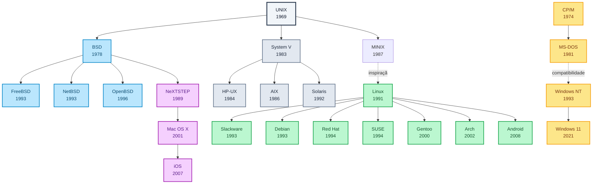

```mermaid
graph TD

%% =========================
%% RAIZ
%% =========================

UNIX["UNIX\n1969"]

%% =========================
%% PRIMEIRA RAMIFICAÇÃO
%% =========================

BSD["BSD\n1978"]
SystemV["System V\n1983"]
MINIX["MINIX\n1987"]

UNIX --> BSD
UNIX --> SystemV
UNIX --> MINIX

%% =========================
%% BSD
%% =========================

FreeBSD["FreeBSD\n1993"]
NetBSD["NetBSD\n1993"]
OpenBSD["OpenBSD\n1996"]

BSD --> FreeBSD
BSD --> NetBSD
BSD --> OpenBSD

%% =========================
%% SYSTEM V
%% =========================

HPUX["HP-UX\n1984"]
AIX["AIX\n1986"]
Solaris["Solaris\n1992"]

SystemV --> HPUX
SystemV --> AIX
SystemV --> Solaris

%% =========================
%% LINUX
%% =========================

Linux["Linux\n1991"]

MINIX -.inspiração.-> Linux

Slackware["Slackware\n1993"]
Debian["Debian\n1993"]
RedHat["Red Hat\n1994"]
SUSE["SUSE\n1994"]
Gentoo["Gentoo\n2000"]
Arch["Arch\n2002"]
Android["Android\n2008"]

Linux --> Slackware
Linux --> Debian
Linux --> RedHat
Linux --> SUSE
Linux --> Gentoo
Linux --> Arch
Linux --> Android

%% =========================
%% APPLE
%% =========================

NeXTSTEP["NeXTSTEP\n1989"]
macOS["Mac OS X\n2001"]
iOS["iOS\n2007"]

BSD --> NeXTSTEP
NeXTSTEP --> macOS
macOS --> iOS

%% =========================
%% MICROSOFT
%% =========================

CPM["CP/M\n1974"]
MSDOS["MS-DOS\n1981"]
WindowsNT["Windows NT\n1993"]
Windows11["Windows 11\n2021"]

CPM --> MSDOS
WindowsNT --> Windows11
MSDOS -.compatibilidade.-> WindowsNT

%% =========================
%% ESTILO ARTÍSTICO
%% =========================

classDef raiz fill:#f1f5f9,color:#0f172a,stroke:#334155,stroke-width:3px;

classDef bsd fill:#bae6fd,color:#0c4a6e,stroke:#0284c7,stroke-width:2px;
classDef sysv fill:#e2e8f0,color:#1e293b,stroke:#64748b,stroke-width:2px;
classDef linux fill:#bbf7d0,color:#14532d,stroke:#16a34a,stroke-width:2px;
classDef apple fill:#f5d0fe,color:#581c87,stroke:#a21caf,stroke-width:2px;
classDef ms fill:#fde68a,color:#78350f,stroke:#f59e0b,stroke-width:2px;

class UNIX raiz;

class BSD,FreeBSD,NetBSD,OpenBSD bsd;
class SystemV,HPUX,AIX,Solaris sysv;
class Linux,Slackware,Debian,RedHat,SUSE,Gentoo,Arch,Android linux;
class NeXTSTEP,macOS,iOS apple;
class CPM,MSDOS,WindowsNT,Windows11 ms;
```
