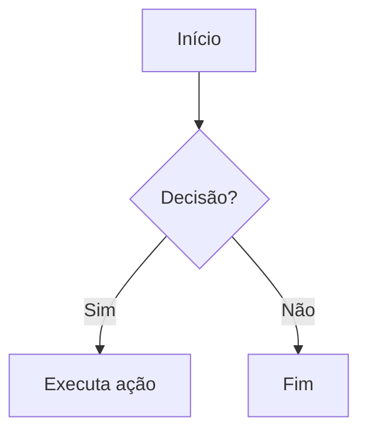
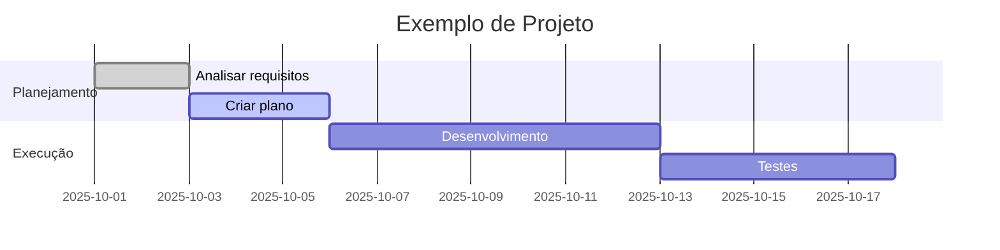
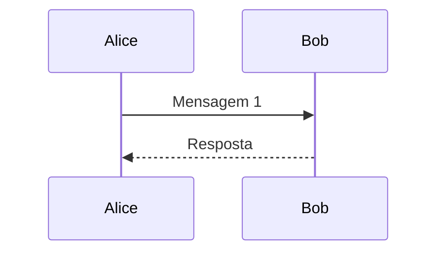
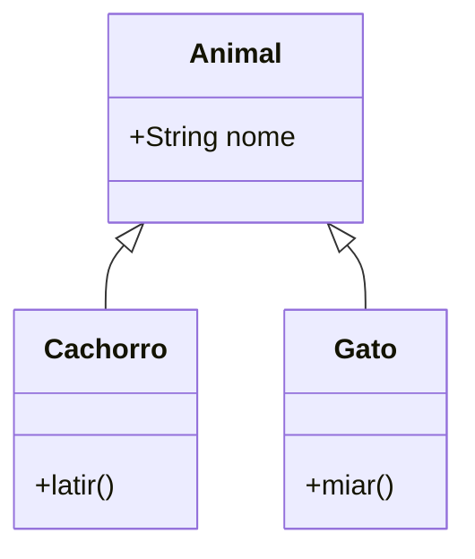

# 🌟 Exemplo Completo e Avançado de Markdown

Este documento mostra **diversos recursos do Markdown**, do básico ao avançado, para deixar seus arquivos mais interessantes, profissionais e interativos.

---

## 📑 Índice
1. [Texto e Listas](#-texto-e-listas)
2. [Links e Imagens](#-links-e-imagens)
3. [Códigos](#-códigos)
4. [Tabelas](#-tabelas)
5. [Checklists](#-checklists)
6. [Citações](#-citações)
7. [Diagramas Mermaid](#-diagramas-mermaid)
8. [Matemática (LaTeX)](#-matemática-latex)
9. [Mídia Avançada](#-mídia-avançada)
10. [Badges e Status](#-badges-e-status)
11. [Spoilers/Colapsáveis](#-spoilerscolapsáveis)
12. [Tabelas Avançadas](#-tabelas-avançadas)
13. [Diagramas Extras](#-diagramas-extras)
14. [ASCII/Unicode](#-asciiunicode)
15. [Blocos de Alerta](#-blocos-de-alerta)
16. [Estrutura de Pastas](#-estrutura-de-pastas)

---

## 📝 Texto e Listas

### Listas não ordenadas:
- Item comum
- **Item em negrito**
- *Item em itálico*
  - Subitem
    - Sub-subitem

### Listas ordenadas:
1. Primeiro
2. Segundo
3. Terceiro

---

## 🔗 Links e Imagens

[Visite o GitHub](https://github.com)  

Imagem exemplo:  


---

## 💻 Códigos

Exemplo de código em **Python**:

```python
def soma(a, b):
    return a + b

print(soma(3, 5))
```

---

## 📊 Tabelas

| Nome       | Idade | Profissão       |
|------------|-------|----------------|
| Ana        | 25    | Engenheira     |
| Bruno      | 30    | Designer       |
| Carlos     | 28    | Desenvolvedor  |

---

## ✅ Checklists

- [x] Criar exemplo Markdown  
- [ ] Revisar formatação  
- [ ] Compartilhar com a equipe  

---

## 💬 Citações

> "Markdown é simples, mas poderoso!"  
> — Alguém inspirado

---

## 📈 Diagramas Mermaid

### Fluxograma


### Diagrama de Gantt


---

## 🔢 Matemática (LaTeX)

Equação de segundo grau:  

$$x = \frac{-b \pm \sqrt{b^2 - 4ac}}{2a}$$  

Integral:  

$$\int_0^\infty e^{-x^2} dx = \frac{\sqrt{\pi}}{2}$$

---

## 🎬 Mídia Avançada

GIF animado:  


Vídeo embutido (HTML):  
<video src="https://www.w3schools.com/html/mov_bbb.mp4" controls width="300"></video>

---

## 🏅 Badges e Status


---

## 📂 Spoilers/Colapsáveis

<details>
  <summary>Ver mais detalhes</summary>
  Aqui dentro pode ter texto, código, imagens etc.
</details>

---

## 📊 Tabelas Avançadas

| Funcionalidade | Status   | Observações       |
|----------------|----------|------------------|
| Login          | ✅ Ok    | Em produção      |
| Pagamentos     | 🚧 Em dev | Falta integração |
| Relatórios     | ❌ Erro  | Revisar queries  |

---

## 📐 Diagramas Extras

### Diagrama de sequência


### Diagrama de classes


---

## 🔡 ASCII/Unicode

Exemplo de menu com **ASCII Art**:  

```text
+---------+
|  MENU   |
+---------+
| Opção 1 |
| Opção 2 |
+---------+
```

---

## ⚠️ Blocos de Alerta

> [!NOTE]  
> Este é um bloco de nota estilizado!  

> [!WARNING]  
> Atenção: algo importante aqui.  

---

# 🌐 Estrutura de Pastas — Projeto Web

```bash
meu-projeto/
├── public/                     # Arquivos públicos acessíveis diretamente
│   ├── index.html              # Página principal
│   ├── favicon.ico             # Ícone do site
│   └── assets/                 # Imagens, ícones, etc.
│       ├── logo.png
│       └── banner.jpg
│
├── src/                        # Código-fonte principal
│   ├── components/             # Componentes reutilizáveis
│   │   ├── Header.jsx
│   │   ├── Footer.jsx
│   │   └── Button.jsx
│   │
│   ├── pages/                  # Páginas da aplicação
│   │   ├── Home.jsx
│   │   ├── About.jsx
│   │   └── Contact.jsx
│   │
│   ├── services/               # Comunicação com APIs / back-end
│   │   └── api.js
│   │
│   ├── hooks/                  # Hooks customizados
│   │   └── useAuth.js
│   │
│   ├── context/                # Contextos globais (ex: autenticação, tema)
│   │   └── AuthContext.jsx
│   │
│   ├── styles/                 # Estilos globais e temas
│   │   ├── global.css
│   │   └── variables.css
│   │
│   ├── App.jsx                 # Componente raiz
│   └── main.jsx                # Ponto de entrada da aplicação
│
├── .gitignore                  # Arquivos ignorados pelo Git
├── package.json                # Dependências e scripts do projeto
├── vite.config.js              # Configuração do bundler (Vite)
└── README.md                   # Documentação do projeto
```

---

## 🎉 Conclusão

Este arquivo `.md` reúne **recursos do básico ao avançado** para deixar sua documentação mais **rica, interativa e atraente**.
